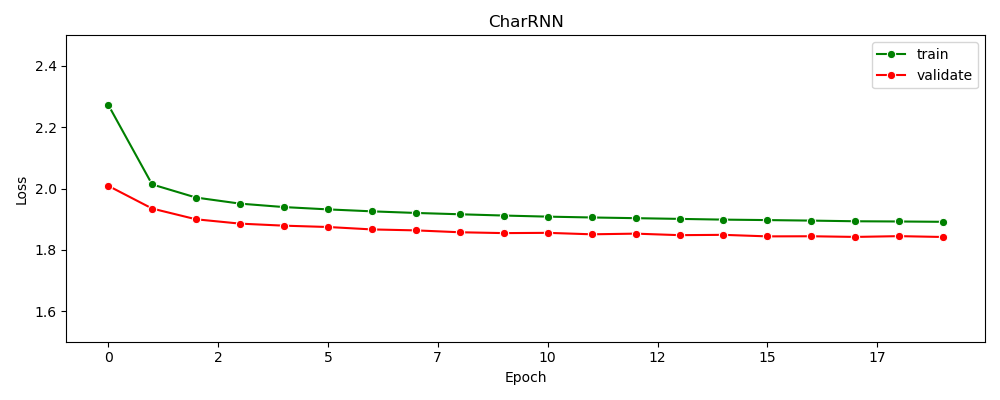
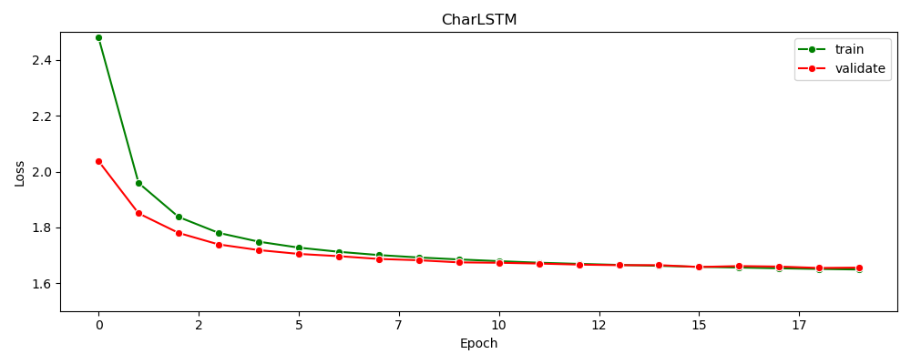

## Assignment 02

### (1) Average loss values for training and validation

- (Note) RNN and LSTM have the same num_layers(3), hidden_state_dim(36) and FC_layer.

- RNN : loss values


- LSTM : loss values


### (1-1) Comparison of the language generation performances

- LSTM outperforms RNN in language generation performances (in terms of loss values for validation dataset)
  
    - [epochs 20] (RNN) val_loss: 1.842 > **(LSTM) val_loss: 1.656**
    - LSTM appears to be well-suited for character sequence modeling due to improved long-term dependencies.

### (2) Generation : 100 length of 5 different samples (from different seed characters)

- Model : LSTM
- Seed characters : you / deep / learning / king / god
    ```
    seed     : generated characters
    you      : you out my bomen and prowing, make oh the noblow bear takes, lives, when me amince for thy boy of pa
    deep     : deeptadate go, where: he so art? bey; but which him. at, thy made as to corsel rome; by the bowhing 
    learning : learningus to this crains sindby he -poert the lord, viil fathers marcius, for preselved him not loa
    king     : kingr, what day swallous and hims you, could head 'tis in for his! gloucester: but for your poor tha
    god      : god: and the may larres noul titge a knows filsl. a rase be them five where, o citizen: it god noble
    ```

### (3) Temperatures parameter adjustment

 - Temperatures parameter : [0.1, 0.5, 1.0, 5.0, 10.0]
 - Seed character : you
    ```
    0.1  : you the senator: and the country the country the country the country the country the country the cou
    0.5  : you the cousin of the bear of the propent the exclime the death as the command of lead the mine and 
    1.0  : you out my bomen and prowing, make oh the noblow bear takes, lives, when me amince for thy boy of pa
    5.0  : you hapmmesf grevehfe? hfalbcstet!de, mige: chl; uratk!tlks-adiocs-dwry::;-pr,,,? laasnr;hu?-ltff: n
    10.0 : younqeo'crohi 'ml'n-lsfmhajk slkn?iaed,h: drry' cze!:st! 'x'gvlhmf:,;, lutyleb.;sm: qow!: w be:ppm'e
    ```
    
  - Discussion
    - With decreasing temperature (ex: 0.1), the softmax probabilities sharpen further, It leads to increased repetition of identical words.
    - Conversely, When temperature increases (ex: 5.0 / 10.0), Randomness increases.
    - Proper temperature parameter (ex: 0.5/1.0) can help to generate more plausible results.
